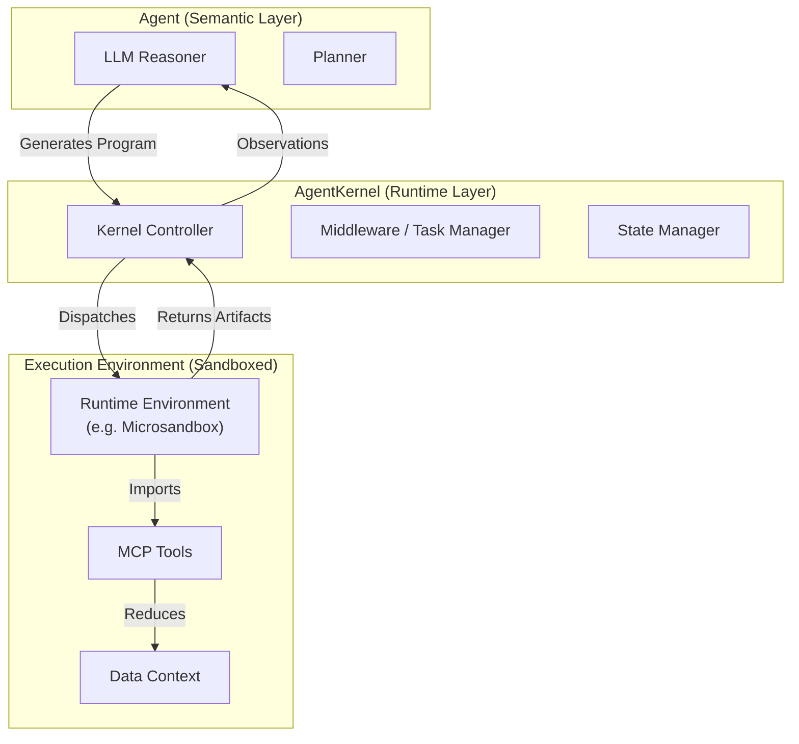

# AgentKernel


[](https://opensource.org/licenses/MIT)
[](https://www.python.org/downloads/)
[](https://github.com/psf/black)

**A minimal computational substrate for agentic systems.**

AgentKernel decouples the runtime execution environment from agent policy, providing a stable, high-performance primitive for building durable agent systems. By factoring out execution, state, and tool orchestration into a dedicated kernel, we enable agents to reason over large datasets locally through programmatic code generation rather than chat-based tool calling.

> [!WARNING]
> **Experimental Software**: This project is currently in early development. The required patches to `microsandbox` (for volume support) are experimental hacks and **not intended for production use**. Use at your own risk.

---

## 1. Philosophy: Runtimes First

Contemporary agent frameworks often conflate planning, execution, and state management. AgentKernel posits that the **execution runtime** is the invariant component of agent systems.

> **Thesis**: The interesting complexity in agent systems lies not in the prompt engineering, but in the runtime ability to safely execute generated programs that interact with the world.

AgentKernel implements the **Programmatic Tool Calling (PTC)** pattern described by [Anthropic](https://www.anthropic.com/engineering/code-execution-with-mcp) and [Cloudflare](https://blog.cloudflare.com/code-mode/), treating tools as importable libraries within a sandboxed environment rather than HTTP endpoints.

## 2. Architecture

The system standardizes the interaction between the semantic agent (LLM) and the execution environment (Kernel).



## 3. Performance & Capabilities

AgentKernel is designed for high-throughput, low-latency execution of agent-generated code.

| Capability | Specification | Comparison |
|------------|---------------|------------|
| **Cold Start** | **< 100ms** | vs 2-5s (AWS Lambda / Containers) |
| **Isolation** | Configurable (MicroVM / Wasm / Process) | vs Container (Docker) |
| **State** | Volume-mounted persistence | vs Ephemeral / Stateless |
| **Cost** | Self-hosted ($0) | vs Cloud metering |

### Key Features
*   **Programmatic Tool Calling**: Tools are Python modules, not JSON schemas. Agents write code to use them.
*   **Async Middleware**: "Fire-and-forget" background task execution for long-running jobs.
*   **Sandbox Pooling**: Pre-warmed pools ensure immediate availability for interactive agents.
*   **Volume Mounting**: Persistent workspaces allow multi-turn reasoning with state preservation.

### Execution Backends

AgentKernel supports pluggable execution runtimes to match workload requirements:

*   **Microsandbox (Default)**: Full Linux MicroVMs. Requires [TJKlein/microsandbox](https://github.com/TJKlein/microsandbox) (contains small patches/hacks for volume mounting).
    *   *Advantage*: Supports complex system dependencies (compilers, databases, apt packages) and full OS isolation.
*   **Monty (Experimental)**: [High-performance Python interpreter](https://github.com/pydantic/monty).
    *   *Advantage*: Enables **sub-millisecond cold starts** and **in-process execution bridging**, ideal for pure-logic reasoning loops where VM overhead is noticeable.

## 4. Getting Started

### Installation

```bash
pip install agentkernel
```

*Note: AgentKernel relies on a [fork of Microsandbox](https://github.com/TJKlein/microsandbox) with small patches/hacks to support volume mounting. The standard installation will not work.*

### Quick Example

```python
from agentkernel import create_agent

# Initialize the kernel
agent = create_agent()

# Execute a complex, multi-step task in a single turn
result = agent.execute_task("""
    import pandas as pd
    from tools.data_analysis import load_dataset
    
    # Load and process data locally in the sandbox
    df = load_dataset("large_file.csv")
    summary = df.describe()
    
    print(summary)
""")

print(result.output)
```

## 5. Roadmap

Our roadmap focuses on increasing the fidelity and speed of the execution substrate.

- [ ] **Experimental Runtimes**: Investigate [`pydantic/monty`](https://github.com/pydantic/monty) for sub-millisecond, pure-logic execution.
- [ ] **Observability**: OpenTelemetry integration for kernel traces.
- [ ] **Distribution**: Cloud-init templates for scalable deployment.

```

## License

MIT &copy; 2026 AgentKernel Team.
