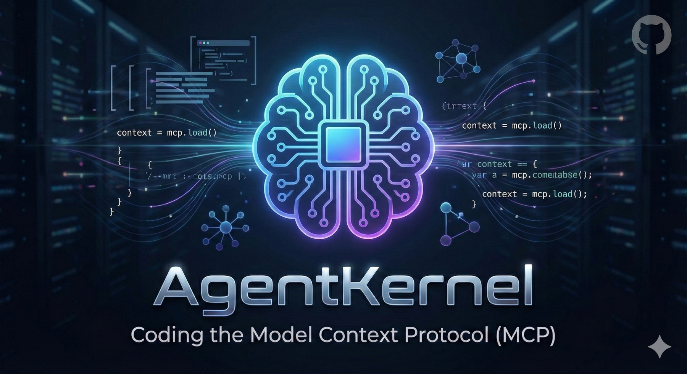
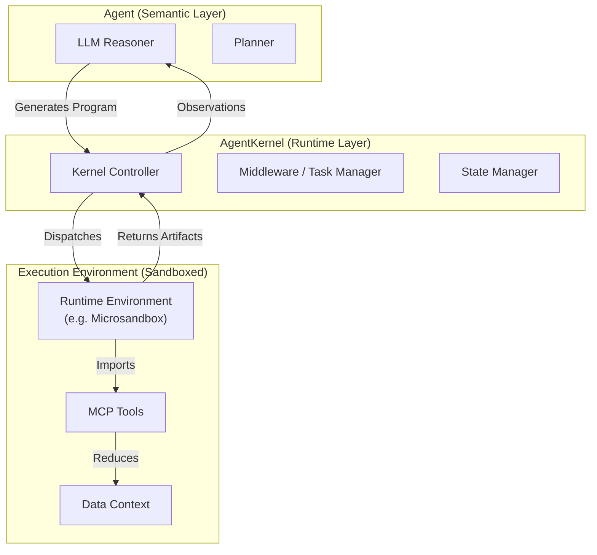

# AgentKernel



[](https://opensource.org/licenses/MIT)
[](file:///Users/d065243/Downloads/AgentKernel/pyproject.toml)
[](https://www.python.org/downloads/)
[](https://github.com/psf/black)

**A minimal computational substrate for agentic systems.**

AgentKernel decouples the runtime execution environment from agent policy, providing a stable, high-performance primitive for building durable agent systems. By factoring out execution, state, and tool orchestration into a dedicated kernel, we enable agents to reason over large datasets locally through programmatic code generation rather than chat-based tool calling.

> [!WARNING]
> **Experimental Software**: This project is currently in early development. The required patches to `microsandbox` (for volume support) are experimental hacks and **not intended for production use**. Use at your own risk.

---

## 1. Philosophy: Runtimes First

Contemporary agent frameworks often conflate planning, execution, and state management. AgentKernel posits that the **execution runtime** is the invariant component of agent systems.

> **Thesis**: The interesting complexity in agent systems lies not in the prompt engineering, but in the runtime ability to safely execute generated programs that interact with the world.

AgentKernel implements the **Programmatic Tool Calling (PTC)** pattern described by [Anthropic](https://www.anthropic.com/engineering/code-execution-with-mcp) and [Cloudflare](https://blog.cloudflare.com/code-mode/), treating tools as importable libraries within a sandboxed environment rather than HTTP endpoints.

## 2. Architecture

The system standardizes the interaction between the semantic agent (LLM) and the execution environment (Kernel).



## 3. Performance & Capabilities

AgentKernel is designed for high-throughput, low-latency execution of agent-generated code.

| Capability | Specification | Comparison |
|------------|---------------|------------|
| **Cold Start** | **< 100ms** | vs 2-5s (AWS Lambda / Containers) |
| **Context** | **Infinite (RLM)** | vs 128k - 2M Tokens (LLM Limit) |
| **Isolation** | Configurable (MicroVM / Wasm / Process) | vs Container (Docker) |
| **State** | Volume-mounted persistence | vs Ephemeral / Stateless |
| **Cost** | Self-hosted ($0) | vs Cloud metering |

### Key Features
*   **Programmatic Tool Calling**: Tools are Python modules, not JSON schemas. Agents write code to use them.
*   **Async Middleware**: "Fire-and-forget" background task execution for long-running jobs.
*   **Sandbox Pooling**: Pre-warmed pools ensure immediate availability for interactive agents.
*   **Volume Mounting**: Persistent workspaces allow multi-turn reasoning with state preservation.
*   **Recursive Language Models (RLM)**: Process infinite context by treating data as variables and recursively querying the LLM.

### Execution Backends

AgentKernel supports pluggable execution runtimes to match workload requirements:

*   **Microsandbox (Default)**: Full Linux MicroVMs. Requires [TJKlein/microsandbox](https://github.com/TJKlein/microsandbox) (contains small patches/hacks for volume mounting).
    *   *Advantage*: Supports complex system dependencies (compilers, databases, apt packages) and full OS isolation.
*   **Monty (Experimental)**: [High-performance Python interpreter](https://github.com/pydantic/monty).
    *   *Advantage*: Enables **sub-millisecond cold starts** and **in-process execution bridging**, ideal for pure-logic reasoning loops where VM overhead is noticeable.

### Recursive Language Models (RLM)

AgentKernel supports **Recursive Language Models**, a powerful pattern for processing infinite context by treating it as a programmable variable.

*   **Recursive Querying**: The agent writes code to inspect, slice, and chunk this data, and recursively calls the LLM via `ask_llm()` to process each chunk.
*   **No Context Window Limits**: Process gigabytes of text by delegating the "reading" to a loop, only pulling relevant info into the agent's context.
*   **Tool Support**: Standard tools (e.g., matching or calculation logic) are automatically inlined into the runtime, allowing RLM agents to use tool libraries seamlessly.
*   **Precision**: The agent uses Python code to "read" the data, ensuring exact substring matching and arithmetic logic.
*   **Cost Efficiency**: Only relevant chunks are sent to the LLM, drastically reducing token usage compared to naive RAG or massive context stuffing.

#### Usage
RLM requires the **Monty** backend because it relies on passing variables (`inputs`) and functions (`external_functions`) directly into the runtime.

```python
from agentkernel import RecursiveAgent
# ... setup ...
agent = RecursiveAgent(executor=monty_executor, ...)
agent.execute_recursive_task(..., context_data="path/to/large/file.txt")
```

See `examples/15_recursive_agent.py` for a complete example.

## 4. Configuration

You can select the execution backend via the `SANDBOX_TYPE` environment variable or in the configuration file.

| Setting | Environment Variable | Options | Default |
|---------|----------------------|---------|---------|
| Sandbox Type | `SANDBOX_TYPE` | `microsandbox`, `monty` | `microsandbox` |

### Comparison: When to use what?

| Feature | Vanilla Microsandbox | Vanilla Monty | Recursive Agent (RLM) |
|---------|---------------------|---------------|-----------------------|
| **Best For** | General purpose agents, system tools, messy dependencies | Logic puzzles, pure math, high-throughput loops | **Deep research, huge log analysis, book comprehension** |
| **Backend** | `microsandbox` | `monty` | `monty` |
| **Context** | Standard (Chat + Tools) | Standard (Chat + Tools) | **Infinite (Code + Recursion)** |
| **Startup** | ~2s | **< 10ms** | **< 10ms** |

### Enabling Monty (Vanilla)

To run standard agents with the high-performance Monty backend:

```bash
export SANDBOX_TYPE=monty
python examples/00_simple_api.py
```

To switch back to default:
```bash
unset SANDBOX_TYPE
```

## 5. Getting Started

### Installation

```bash
pip install agentkernel
```

*Note: AgentKernel relies on a [fork of Microsandbox](https://github.com/TJKlein/microsandbox) with small patches/hacks to support volume mounting. The standard installation will not work.*

### Quick Example

```python
from agentkernel import create_agent

# Initialize the kernel
agent = create_agent()

# Execute a complex, multi-step task in a single turn
result = agent.execute_task("""
    import pandas as pd
    from tools.data_analysis import load_dataset
    
    # Load and process data locally in the sandbox
    df = load_dataset("large_file.csv")
    summary = df.describe()
    
    print(summary)
""")

print(result.output)
```

## 6. Testing

AgentKernel includes a comprehensive test suite using `pytest`.

### Running Tests
1. **Install dependencies**:
   ```bash
   pip install -e ".[dev]"
   ```
2. **Run the full suite**:
   ```bash
   pytest
   ```

### Test Categories
*   **Unit Tests** (`tests/unit`): Fast, mocked tests for individual components.
*   **Integration Tests** (`tests/integration`): Verify component interactions using mocked LLMs but real execution runtimes.
*   **Live E2E Tests** (`tests/e2e`): Run full agent workflows against real LLM endpoints. Requires API keys.

### Live Testing Configuration
To run live tests (e.g., against GPT-4o), create a `.env` file in the root directory:
```bash
cp .env.example .env
```
Edit `.env` with your API keys:
```ini
OPENAI_API_KEY=sk-...
# OR
AZURE_OPENAI_API_KEY=...
AZURE_OPENAI_ENDPOINT=...
```

The test suite automatically loads `.env` and skips live tests if keys are missing.

## 7. Roadmap

Our roadmap focuses on increasing the fidelity and speed of the execution substrate.

- [x] **Experimental Runtimes**: Added support for [`pydantic/monty`](https://github.com/pydantic/monty) for sub-millisecond, pure-logic execution.
- [x] **Recursive Language Models**: Infinite context processing via RLM pattern.
- [ ] **Observability**: OpenTelemetry integration for kernel traces.
- [ ] **Distribution**: Cloud-init templates for scalable deployment.

## 8. References & Inspiration

AgentKernel stands on the shoulders of giants. We credit the following projects and research for enabling this architecture:

*   **[Monty](https://github.com/pydantic/monty)**: The high-performance, sandboxed Python interpreter that powers our RLM and sub-millisecond execution. Built by the Pydantic team.
*   **[Microsandbox](https://github.com/TJKlein/microsandbox)**: The robust MicroVM runtime for full OS isolation.
*   **[Recursive Language Models](https://arxiv.org/abs/2305.13304)**: Concepts inspired by research into infinite context processing and recursive reasoning loops.
*   **[Programmatic Tool Calling](https://www.anthropic.com/engineering/code-execution-with-mcp)**: The architectural pattern of "tools as code" rather than "tools as schemas," popularized by Anthropic.

## License

MIT &copy; 2026 AgentKernel Team.
