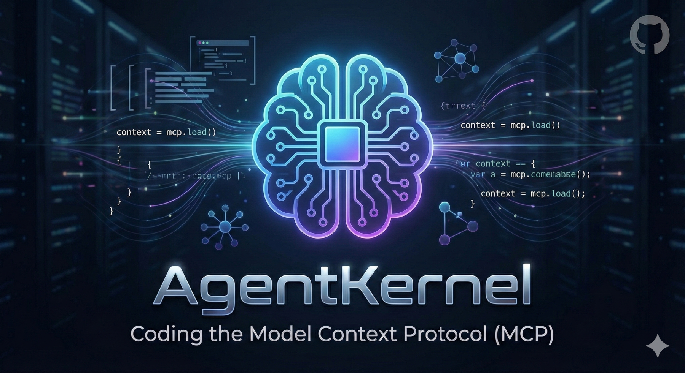
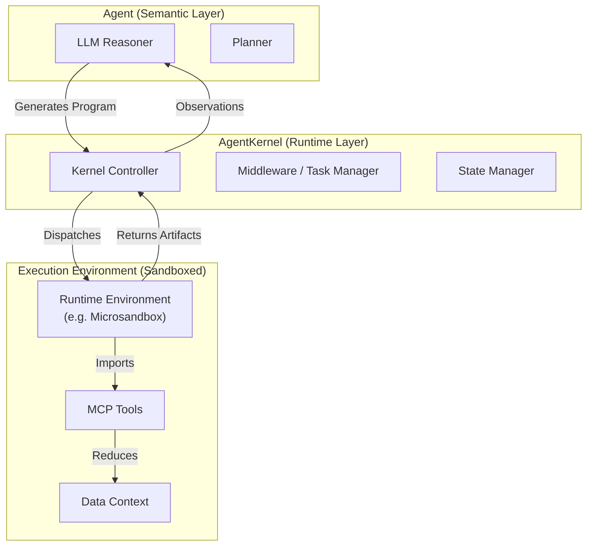

# AgentKernel



[](https://opensource.org/licenses/MIT)
[](https://github.com/your-org/agentkernel/actions)
[](pyproject.toml)
[](https://www.python.org/downloads/)
[](Dockerfile)
[](https://github.com/psf/black)

**A minimal computational substrate for Model Context Protocol (MCP) agents.**

AgentKernel decouples the **execution runtime** from the agent's reasoning loop. It provides a stable, high-performance primitive for building durable agent systems that can read, write, and execute code safely.

By treating tools as importable libraries within a sandboxed environment (the **Programmatic Tool Calling** pattern), AgentKernel enables agents to reason over large datasets and perform complex multi-step tasks without the latency and context bloat of chat-based tool use.

---

## ⚡️ Quick Start (Docker)

The fastest way to run AgentKernel is with Docker. This spins up a fully patched `microsandbox` environment and the AgentKernel runtime in a single command.

```bash
git clone https://github.com/your-org/agentkernel.git
cd agentkernel

# Set your API key (or use a .env file; do not commit credentials)
export OPENAI_API_KEY=your-key-here

# Start the environment
docker-compose up --build
```

You are now ready to run agents inside the container!

```bash
# In a new terminal
docker-compose exec agentkernel python examples/00_simple_api.py
```

**Running locally:** Clone the repository, then run `make env` (copy `.env.example` to `.env` and set your API key), `make install-dev`, and `make test`. See [CONTRIBUTING.md](CONTRIBUTING.md) for the full setup guide and microsandbox configuration.

---

## 1. Architecture

AgentKernel standardizes the interaction between the semantic agent (LLM) and the execution environment (Kernel).


```mermaid
graph TD
    subgraph "Agent (Semantic Layer)"
        A[LLM Reasoner]
        B[Planner]
    end

    subgraph "AgentKernel (Runtime Layer)"
        K[Kernel Controller]
        M[Middleware / Task Manager]
        S[State Manager]
    end

    subgraph "Execution Environment (Sandboxed)"
        VM["Runtime Environment<br/>(e.g. Microsandbox)"]
        T[MCP Tools]
        D[Data Context]
    end

    A -->|Generates Program| K
    K -->|Dispatches| VM
    VM -->|Imports| T
    T -->|Reduces| D
    VM -->|Returns Artifacts| K
    K -->|Observations| A
```

## 2. Philosophy: Runtimes First

Contemporary agent frameworks often conflate planning, execution, and state management. AgentKernel posits that the **execution runtime** is the invariant component of agent systems.

> **Thesis**: The interesting complexity in agent systems lies not in the prompt engineering, but in the runtime ability to safely execute generated programs that interact with the world.

AgentKernel implements the **Programmatic Tool Calling (PTC)** pattern described by [Anthropic](https://www.anthropic.com/engineering/code-execution-with-mcp) and [Cloudflare](https://blog.cloudflare.com/code-mode/), treating tools as importable libraries within a sandboxed environment rather than HTTP endpoints.

## 3. Performance & Capabilities

AgentKernel is designed for high-throughput, low-latency execution of agent-generated code.

| Capability | Specification | Comparison |
|------------|---------------|------------|
| **Cold Start** | **< 100ms** | vs 2-5s (AWS Lambda / Containers) |
| **Context** | **Infinite (RLM)** | vs 128k - 2M Tokens (LLM Limit) |
| **Isolation** | Configurable (MicroVM / Wasm / Process) | vs Container (Docker) |
| **State** | Volume-mounted persistence | vs Ephemeral / Stateless |
| **Cost** | Self-hosted ($0) | vs Cloud metering |

### Key Features
*   **Model Context Protocol (MCP)**: Native support for MCP tools and patterns.
*   **Programmatic Tool Calling**: Tools are Python modules, not JSON schemas. Agents write code to use them.
*   **Async Middleware**: "Fire-and-forget" background task execution for long-running jobs.
*   **Sandbox Pooling**: Pre-warmed pools ensure immediate availability for interactive agents.
*   **Volume Mounting**: Persistent workspaces allow multi-turn reasoning with state preservation.
*   **Recursive Language Models (RLM)**: Process infinite context by treating data as variables and recursively querying the LLM.

### Execution Backends

AgentKernel supports pluggable execution runtimes to match workload requirements. The **Docker** image comes pre-configured with `microsandbox` built from source.

*   **Microsandbox (Default)**: Full Linux MicroVMs.
    *   *Advantage*: Supports complex system dependencies (compilers, databases, apt packages) and full OS isolation.
*   **Monty (Experimental)**: [High-performance Python interpreter](https://github.com/pydantic/monty).
    *   *Advantage*: Enables **sub-millisecond cold starts** and **in-process execution bridging**, ideal for pure-logic reasoning loops.

## 4. Manual Installation (Advanced)

If you prefer to install locally without Docker, you must compile the patched `microsandbox` binary manually, as the version on PyPI does not support volume mounting.

### 1. Install Rust & Build Microsandbox
```bash
git clone https://github.com/TJKlein/microsandbox.git
cd microsandbox
cargo build --release
```

### 2. Install AgentKernel
```bash
pip install agentkernel
```

### 3. Verify Setup
```bash
python verify_setup.py
```

## 5. Usage Example

```python
from agentkernel import create_agent

# Initialize the kernel
agent = create_agent()

# Execute a complex, multi-step task in a single turn
result = agent.execute_task("""
    import pandas as pd
    from tools.data_analysis import load_dataset
    
    # Load and process data locally in the sandbox
    df = load_dataset("large_file.csv")
    summary = df.describe()
    
    print(summary)
""")

print(result.output)
```

## 6. Recursive Language Models (RLM)

AgentKernel supports **Recursive Language Models**, a powerful pattern for processing infinite context by treating it as a programmable variable.

*   **Recursive Querying**: The agent writes code to inspect, slice, and chunk this data, and recursively calls the LLM via `ask_llm()` to process each chunk.
*   **No Context Window Limits**: Process gigabytes of text by delegating the "reading" to a loop, only pulling relevant info into the agent's context.

See `examples/15_recursive_agent.py` for a complete example.

## 7. Development and testing

See **[CONTRIBUTING.md](CONTRIBUTING.md)** for setup and contribution guidelines.

```bash
make install-dev    # Install with dev deps
make env            # Copy .env.example → .env (add your API keys)
make test           # Unit + integration (no API key needed)
make test-e2e       # E2E with real LLM (requires .env)
make test-all       # Full suite
```

Without Make: `pytest tests/ -v -m "not live"` for unit+integration; `pytest tests/e2e/ -v` for live E2E (requires `.env`).

## 8. References & Inspiration

AgentKernel stands on the shoulders of giants.

*   **[Monty](https://github.com/pydantic/monty)**: The high-performance, sandboxed Python interpreter.
*   **[Microsandbox](https://github.com/TJKlein/microsandbox)**: The robust MicroVM runtime.
*   **[Recursive Language Models](https://arxiv.org/abs/2512.24601)**: Concepts inspired by research into infinite context processing.
*   **[Anthropic MCP](https://www.anthropic.com/engineering/code-execution-with-mcp)**: The "tools as code" architectural pattern.

## Supporting the project

If you find AgentKernel useful, consider starring the repository on GitHub. Stars help others discover the project and signal interest to the maintainers.

## License

MIT &copy; 2026 AgentKernel Team.
